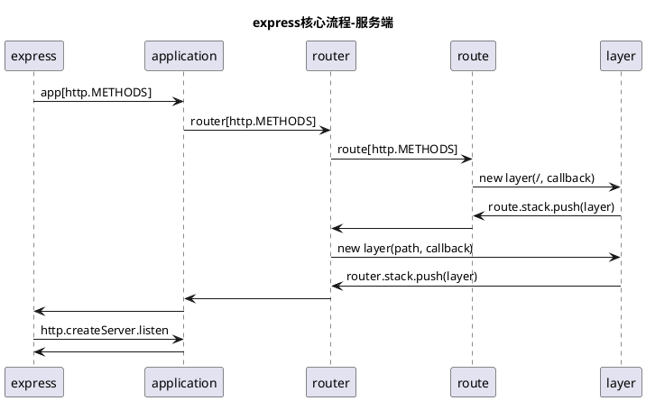
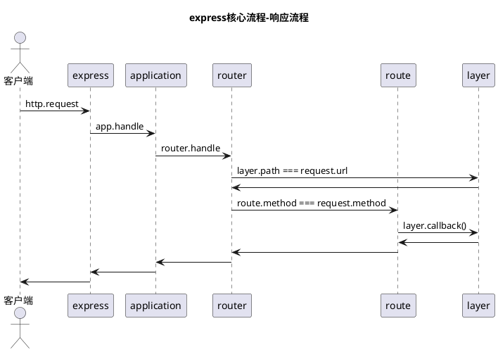

# 学习express框架

### 流程图

#### 流程代码

```plantuml
@startuml
title express核心流程-服务端

participant express as exp
participant application as app
participant router
participant route
participant layer

exp -> app: app[http.METHODS]
app -> router: router[http.METHODS]
router -> route: route[http.METHODS]
route -> layer: new layer(/, callback)
route <- layer: route.stack.push(layer)
router <- route

router -> layer: new layer(path, callback)
router <- layer: router.stack.push(layer)

app <- router
exp <- app

exp -> app: http.createServer.listen
exp <- app

@enduml
```

#### 流程代码

```plantuml
@startuml
title express核心流程-响应流程

actor 客户端 as client
participant express as exp
participant application as app
participant router
participant route
participant layer

client -> exp: http.request
exp -> app: app.handle
app -> router: router.handle
router -> layer: layer.path === request.url
router <- layer

router -> route: route.method === request.method
route -> layer: layer.callback()
route <- layer
router <- route

app <- router
exp <- app
client <- exp

@enduml
```

### 参考资料

* [Express 源码仿制教程](https://wangzhechao.com/express_1/)